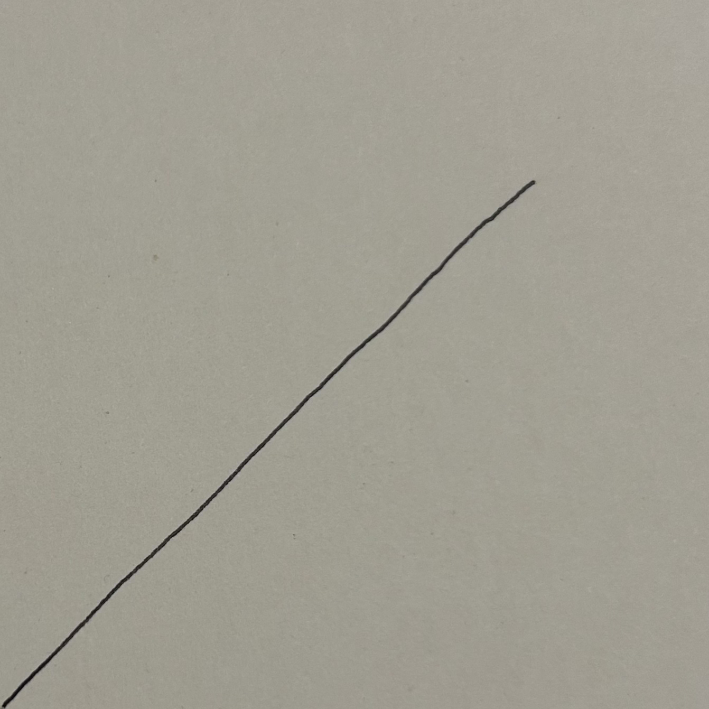
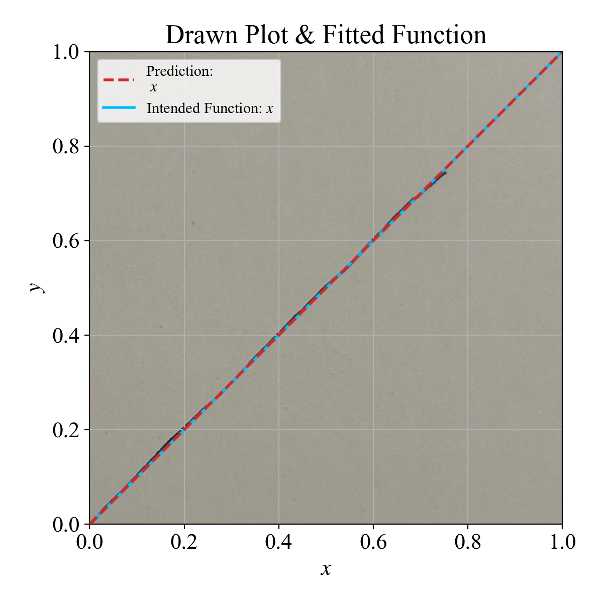
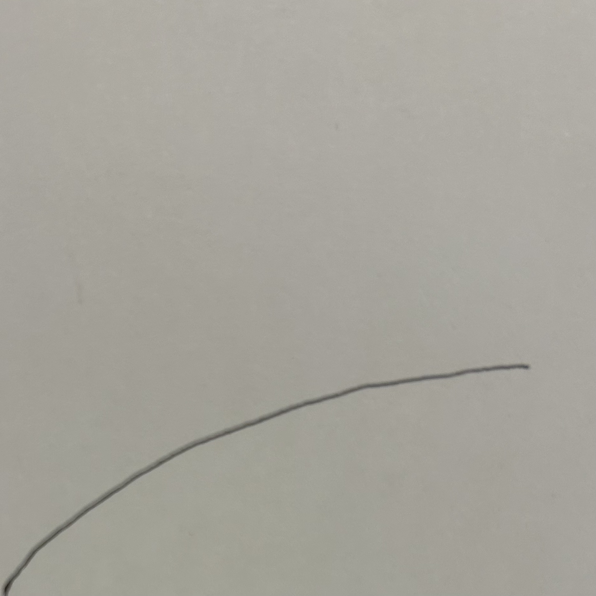
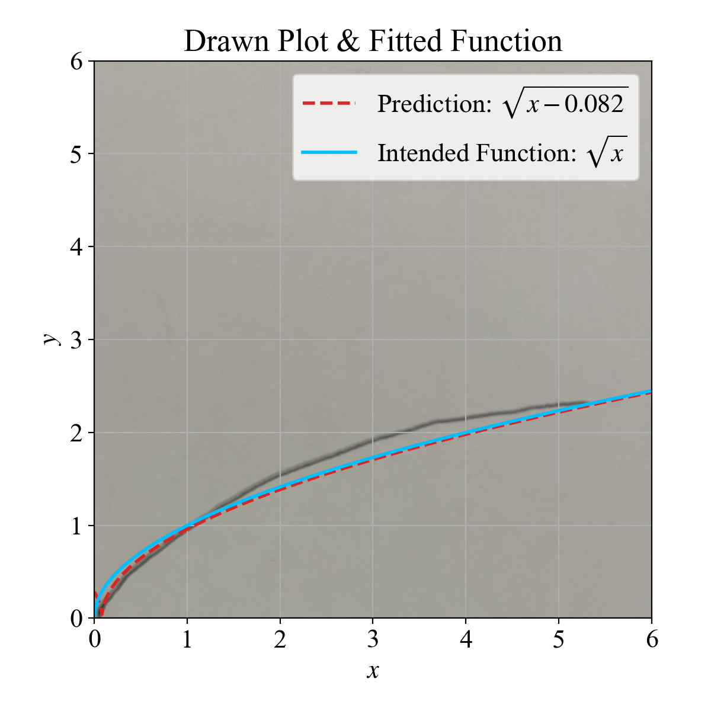

# Image2Function

A Python toolkit for reading a hand-drawn (or otherwise rendered) plot image, extracting its pixel coordinates, clustering and removing outliers, and performing symbolic regression to recover an analytic function that fits the drawn curve. It can also load and save pre-trained models, convert between GP expressions and LaTeX, and plot the results.

---

## Table of Contents

- [Features](#features)  
- [Requirements](#requirements)  
- [Installation](#installation)  
- [Usage](#usage)  
  - [1. Basic Image Fitting](#1-basic-image-fitting)  
  - [2. Custom Domain/Range](#2-custom-domainrange)  
  - [3. Load/Save a Model](#3-loadsave-a-model)  
  - [4. Convert GP Program to LaTeX](#4-convert-gp-program-to-latex)  
  - [5. Convert LaTeX to Numeric Function](#5-convert-latex-to-numeric-function)  
- [API Reference](#api-reference)  
  - [`file_checker(file_name, file_type)`](#file_checkerfilename-file_type)  
  - [`image_reader(input_image_location)`](#image_readerinput_image_location)  
  - [`image_fitter(…)`](#image_fitter-input_image_location-x_domain01-y_range01-model_path-none-use_saved-true-intd_expr-none-show_clusters-false-show_cluster_outliers-false-show_image-true)  
  - [`genetic_fitter(x_vals, y_vals, …)`](#genetic_fitterx_vals-y_vals-x_domain01-y_range01-model_path-none-use_saved-true)  
  - [`SymbRegg_to_latex(gp_prog)`](#symbregg_to_latexgp_prog)  
  - [`Latex_to_function(latex_string, x_domain)`](#latex_to_functionlatex_string-x_domain)  
- [Configuration](#configuration)  
- [Contributing](#contributing)  
- [License](#license)  

---

## Features

- **Robust file lookup** (`file_checker`)  
- **Greyscale image ingestion** with automatic binarization and inversion (`image_reader`)  
- **Outlier removal** via DBSCAN, picking the largest cluster  
- **Symbolic regression** using `gplearn` to evolve analytic expressions  
- **Model persistence** (save/load with `joblib`)  
- **GP expression ↔ LaTeX** conversion via `sympy`  
- **LaTeX ↔ numeric function** conversion and evaluation  
- **Publication-quality plotting** (custom fonts, aspect ratio, annotations)

---

## Requirements

- Python 3.8+  
- [numpy](https://pypi.org/project/numpy/)  
- [Pillow](https://pypi.org/project/Pillow/)  
- [matplotlib](https://pypi.org/project/matplotlib/)  
- [gplearn](https://pypi.org/project/gplearn/)  
- [joblib](https://pypi.org/project/joblib/)  
- [scikit-learn](https://pypi.org/project/scikit-learn/)  
- [sympy](https://pypi.org/project/sympy/)  
- **antlr4-python3-runtime==4.11.0**  
  > ⚠️ This script requires exactly `antlr4-python3-runtime==4.11.0`. Other versions are not supported.

---

## Installation

1. Clone this repository (or copy **Image2Function.py** into your project)  
2. Create a virtual environment (recommended):  
   ```bash
   python -m venv venv
   source venv/bin/activate    # on Windows use `venv\Scripts\activate`

3.  **Install dependencies**
    ```
    pip install numpy pillow matplotlib gplearn joblib scikit-learn sympy antlr4-python3-runtime==4.11.0
    ```

## Usage

### 1\. Basic Image Fitting

```
from Image2Function import image_fitter

image_fitter(
    input_image_location='function_x.png',
    model_path='function_x_model.joblib',
    use_saved=True,
    intd_expr='x',
    x_domain=[0, 1],
    y_range=[0, 1],
    show_cluster_outliers=True,
    show_clusters=False,
    show_image=True
)
```

### 2\. Custom Domain/Range

```
image_fitter(
    'my_plot.png',
    x_domain=[-5, 5],
    y_range=[0, 100]
)
```

### 3\. Load/Save a Model

-   **First run** (no saved model): evolves and saves to `saved_model.joblib`.
    
-   **Subsequent runs**: set `use_saved=True` to load the existing model instead of re-training.
    

### 4\. Convert GP Program to LaTeX

```
x_pred, y_pred, gp_program = genetic_fitter(x_vals, y_vals)
latex_str = SymbRegg_to_latex(gp_program)
```

### 5\. Convert LaTeX to Numeric Function

```
from Image2Function import Latex_to_function
x_vals, y_vals = Latex_to_function(r"\frac{\sin(x)}{x}", x_domain=[0, 10])
```
## Examples

This section demonstrates the toolkit on two sample plots: a straight line (y = x) and a square-root curve (y = √x). In each case, the goal is to recover the underlying function from the plot image.

### Example 1: Linear Function (f(x) = x)

A hand-drawn plot of the linear function y = x is provided as the input. The `image_fitter` processes this image to extract its pixel coordinates and perform symbolic regression to fit a function.

**Input Plot:**  


**Fitted Function Plot:**  


The fitted result (red dashed line) overlaps closely with the original drawn line (blue points/line). The symbolic regression returns the formula `x`, which matches the intended linear function.

### Example 2: Square Root Function (f(x) = √x)

This example uses a plot of the square root function y = √x. The curved plot is fed into the `image_fitter` to test the algorithm’s ability to handle a non-linear shape.

**Input Plot:**  


**Fitted Function Plot:**  


The fitted curve (red dashed line) closely follows the drawn points for y = √x (blue). The symbolic regression yields the formula `\sqrt{x}`, successfully recovering the intended function.
## API Reference

### `file_checker(file_name, file_type)`

Verifies that `file_name` exists (absolute path or project-wide search), filters by `file_type` (extension or list), and suggests close matches if not found.

-   **Inputs**
    
    -   `file_name` – filename or full path (string)
        
    -   `file_type` – extension (e.g. `'.png'`) or list of extensions
        
-   **Returns**
    
    -   Full path to the matched file (string)
        
-   **Raises**
    
    -   `FileNotFoundError` with suggestions or message
        

___

### `image_reader(input_image_location)`

Loads a grayscale image, enforces squareness, auto-inverts dark backgrounds, thresholds, and extracts non-white pixel coordinates.

-   **Inputs**
    
    -   `input_image_location` – path to image (string)
        
-   **Returns**
    
    -   `[x_vals, y_vals, width, height, img_for_plot]`
        

___

### `image_fitter(input_image_location, x_domain=[0,1], y_range=[0,1], model_path=None, use_saved=True, intd_expr=None, show_clusters=False, show_cluster_outliers=False, show_image=True)`

High-level pipeline combining `image_reader`, DBSCAN outlier filtering, `genetic_fitter`, LaTeX conversion, and plotting.

-   **Key parameters**
    
    -   `input_image_location` – path to square image (string)
        
    -   `x_domain`, `y_range` – numeric scaling bounds (lists)
        
    -   `model_path` – where to save/load the GP model (string or None)
        
    -   `use_saved` – whether to load existing model (bool)
        
    -   `intd_expr` – LaTeX string for intended function (string or None)
        
    -   `show_clusters`, `show_cluster_outliers`, `show_image` – booleans
        

___

### `genetic_fitter(x_vals, y_vals, x_domain=[0,1], y_range=[0,1], model_path=None, use_saved=True)`

Runs `gplearn.SymbolicRegressor` on provided data or loads a saved model.

-   **Returns** – `[x_pred, y_pred, gp_program]`
    

___

### `SymbRegg_to_latex(gp_prog)`

Converts a `gplearn` program into a LaTeX string via `sympy`.

-   **Inputs**
    
    -   `gp_prog` – a `gplearn._program._Program` object
        
-   **Returns**
    
    -   LaTeX representation (string)
        

___

### `Latex_to_function(latex_string, x_domain)`

Parses a LaTeX expression into a numeric function and evaluates on a linspace over `x_domain`.

-   **Returns** – `[x_values, y_values]`
    

## Configuration

-   **`proj_dir` detection**:  
    The script determines `proj_dir` by stripping the script path. It expects your main module to be named `Image2Function.py`.
    
-   **ANTLR requirement**:  
    Only version **4.11.0** is supported (`pip install antlr4-python3-runtime==4.11.0`).
    

## Contributing

1.  Fork the repository
    
2.  Create a feature branch (`git checkout -b feature/foo`)
    
3.  Commit your changes (`git commit -am 'Add feature'`)
    
4.  Push to the branch (`git push origin feature/foo`)
    
5.  Open a Pull Request
    

## License

This project is released under the MIT License

## Contact

Owen Root  
_Physics PhD Candidate, Quantum Information & Bio-Photonics_  
Email: owenbroughallroot@gmail.com
GitHub: [github.com/yagoiroot](https://github.com/yoagoiroot)
